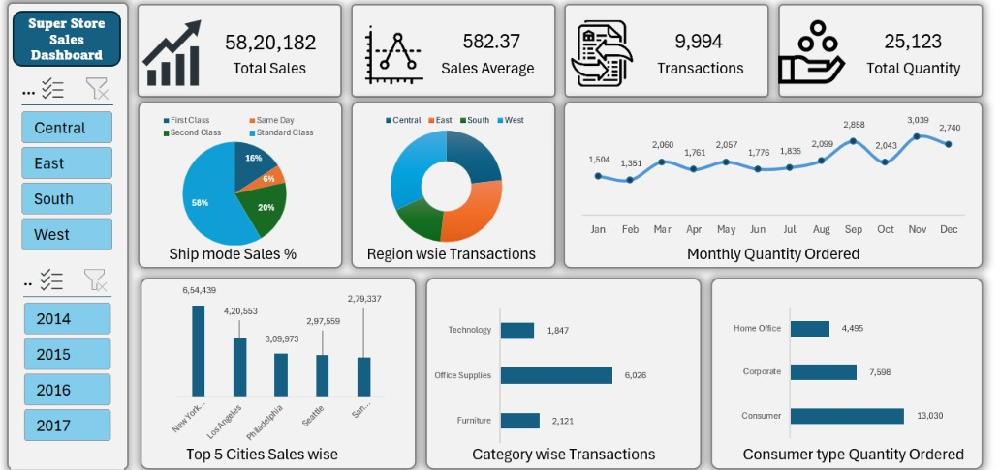

# 📊 Super Store Sales Analytics Dashboard

## Executive Summary
This dashboard provides a comprehensive analysis of sales performance across a 4-year period. By utilizing Excel’s advanced data modeling, I transformed raw transactional data into actionable insights, identifying key drivers for a 54.3% growth in revenue.

## 🛠 Tech Stack

* **Data Analysis:** Pivot Tables, Data Cleaning, Trend Forecasting
* **Visualization:** Interactive Dashboards, Slicers, Pivot Charts

## 📈 Key Insights
* **Revenue Growth:** Achieved 54.3% cumulative growth, with a notable recovery and acceleration in 2016 (+30.67%) and 2017 (+18.66%).
* **Regional Dominance:** The West Region consistently leads in transaction volume, providing a blueprint for regional strategy.
* **Customer Segmentation:** The Consumer segment is the primary engine for order volume, highlighting the necessity for consumer-focused marketing.
* **Operational Efficiency:** Standard Class shipping is the preferred customer choice, indicating price sensitivity.

## 💡 Business Recommendations
1.  **Q4 Preparedness:** Inventory should be scaled up in anticipation of the November peak.
2.  **Product Strategy:** Since Office Supplies drives high volume, bundle these items with slower-moving categories to improve average order value.

## Dashboard Preview

## 📂 Project Files
* [Download Dashboard (.xlsx)]()
* [View Raw Dataset](link-to-data)
